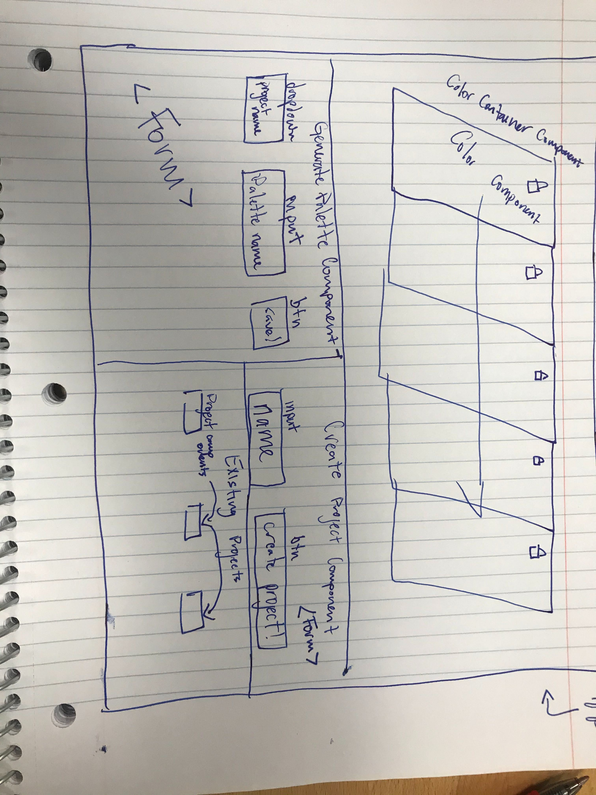

# Palette Picker UI

## About
Palette Picker is an application that allows users to create projects and palettes, which are collections of five, randomly-generated hex codes, and save those palettes to a specific project.

## Authors
* Eric O'Neill ([EONeill23](https://github.com/eoneill23))
* Aidan McKay ([JellyBeans1312](https://github.com/JellyBeans1312))

## Getting started
* Clone down the repo and install the dependencies with `npm install`.
* Run `npm start` and visit (http://localhost:3000/)[http://localhost:3000] to view the application in the browser.
* Run the test suite with `npm test`.

## Learning goals
Hone skills in:
* React
* Redux
* Express
* Knex
* PostgreSQL
* Asynchronous JavaScript

## Built with
* React
* Redux
* Express
* Knex
* PostgreSQL
* Class React components
* Functional React components
* Fetch API
* Testing with Jest and Enzyme
* CSS

## Wireframe

## Images

